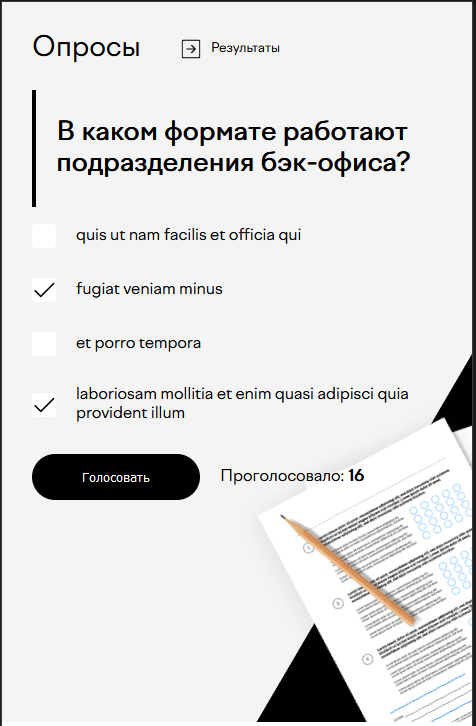
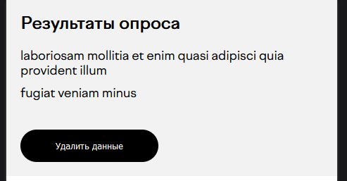
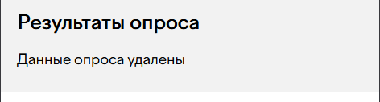
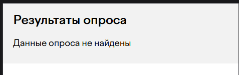

# ask-for-corus



Сам компонент




Данные на странице "/results"




Сообщение при удалении



Сообщение, если данных нет


## Хранение данных
Для хранения использовался LocalStorage


## Установка проекта

```sh
npm install
```

### Разработка

```sh
npm run dev
```


